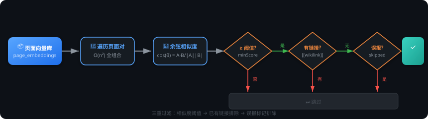

# Obsidian-YOLO-llm-wiki-mcp

[中文](#中文) | [English](#english)

---

## 中文

用于管理 [LLM-Wiki](https://gist.github.com/karpathy/442a6bf555914893e9891c11519de94f) 知识库的 MCP 服务器——提供搜索、语义关联检查和决策工作流管理。

### 项目亮点

#### 1. 三通道融合搜索

同时发起 Grep 关键词匹配、页面向量余弦相似度、YOLO PGlite 分块向量三路查询，结果自动合并去重并按相关性排序。语义通道提供精确的相关性分数，Grep 通道补充零成本的关键词覆盖，两者互补不冲突。


#### 2. 语义关联巡检（Lint）

自动扫描知识库中语义高度相似但缺少 Wikilink 的页面对，帮助发现隐藏的知识关联。支持误报标记，避免重复干扰。



#### 3. 人机协作决策工作流

LLM 遇到矛盾或不确定的信息时，不会自行判断，而是创建结构化的决策条目（带可选项和后果说明）写入 `decisions.md`。用户在 Obsidian 中勾选或通过对话解决，支持事后修正，决策过程完全可追溯。


#### 4. YOLO PGlite 双策略集成

优先通过 `obsidian eval` CLI 实时查询 Obsidian 中 YOLO 插件的 PGlite 向量库；Obsidian 未运行时自动回退到本地缓存的 PGlite 数据库，确保搜索始终可用。


#### 5. 零外部依赖

仅依赖 `@modelcontextprotocol/sdk` 和 `@electric-sql/pglite`，Embedding API 客户端使用 Node.js 原生 `http`/`https` 模块实现，兼容任何 OpenAI 格式的 Embedding 端点。

```
┌─────────────────────────────────────────────────┐
│              Obsidian-YOLO-llm-wiki-mcp          │
├─────────────────────────────────────────────────┤
│  @modelcontextprotocol/sdk   (MCP 协议)         │
│  @electric-sql/pglite        (向量数据库)       │
│  Node.js http/https          (Embedding 客户端) │
│  child_process (grep/obsidian) (系统命令)       │
├─────────────────────────────────────────────────┤
│  外部依赖 = 2    |    原生模块 = 2              │
└─────────────────────────────────────────────────┘
```

#### 6. 增量更新

支持单页面向量增量更新（`update_page_store`），编辑一个页面后无需重建整个索引。


### 功能特性

| 工具 | 说明 |
|------|------|
| `search_wiki` | 三通道并行搜索（grep、页面向量、PGlite 分块） |
| `lint_connections` | 查找语义相似但尚未建立链接的页面 |
| `mark_skipped_connection` | 标记误报的检查结果以忽略 |
| `build_page_store` | 构建/重建页面向量索引 |
| `update_page_store` | 编辑后更新单个页面的向量 |
| `list_decisions` | 列出待处理和已解决的决策 |
| `create_decision` | 创建带可选项的决策条目 |
| `resolve_decision` | 选择选项以解决决策 |
| `correct_decision` | 对已解决的决策添加修正 |

### 安装

```bash
npm install
```

### 配置

设置环境变量：

| 变量 | 必需 | 说明 |
|------|------|------|
| `VAULT_ROOT` | 否 | Obsidian 知识库的绝对路径，默认为包的 `../../` 相对路径 |
| `EMBED_API_URL` | 是 | Embedding API 端点（兼容 OpenAI 格式） |
| `EMBED_API_KEY` | 是 | Embedding API 密钥 |
| `EMBED_MODEL` | 否 | Embedding 模型名称，默认 `Qwen/Qwen3-Embedding-8B` |

#### Claude Code / Cursor / Windsurf

添加到 MCP 配置文件（如 `.claude/mcp.json`）：

```json
{
  "mcpServers": {
    "llm-wiki": {
      "command": "node",
      "args": ["/path/to/Obsidian-YOLO-llm-wiki-mcp/server.js"],
      "env": {
        "VAULT_ROOT": "/path/to/your/obsidian/vault",
        "EMBED_API_URL": "https://api.example.com/v1",
        "EMBED_API_KEY": "sk-xxx",
        "EMBED_MODEL": "Qwen/Qwen3-Embedding-8B"
      }
    }
  }
}
```

#### Claude Desktop

添加到 macOS 的 `~/Library/Application Support/Claude/claude_desktop_config.json` 或 Windows 的 `%APPDATA%\Claude\claude_desktop_config.json`：

```json
{
  "mcpServers": {
    "llm-wiki": {
      "command": "node",
      "args": ["/path/to/Obsidian-YOLO-llm-wiki-mcp/server.js"],
      "env": {
        "VAULT_ROOT": "/path/to/your/obsidian/vault",
        "EMBED_API_URL": "https://api.example.com/v1",
        "EMBED_API_KEY": "sk-xxx"
      }
    }
  }
}
```

### 知识库结构

服务器期望的知识库目录结构：

```
your-vault/
├── wiki/                    # Wiki 页面（实体、概念、综合）
│   ├── decisions.md         # 决策日志（由决策工具管理）
│   ├── log.md               # 操作日志
│   └── ...
├── index.md                 # 内容索引
└── .source-tracker/         # 自动生成的缓存（页面向量、检查状态）
```

页面 frontmatter 应包含 `type`、`status`、`claim_type`、`sources` 等字段。完整规范见 `schema/llm-wiki-schema.md`。

### 架构

```
server.js
├── tools/
│   ├── search.js      # 三通道搜索
│   ├── lint.js        # 语义关联检查
│   ├── store.js       # 页面向量存储管理
│   └── decisions.js   # 决策日志增删改查
└── lib/
    ├── config.js      # VAULT_ROOT 解析
    ├── embed.js       # Embedding API 客户端 + 余弦相似度
    ├── page-store.js  # 页面向量存储读写搜索
    └── pglite.js      # YOLO PGlite 集成（实时 + 缓存回退）
```

#### 搜索通道

1. **Grep** — 对 `wiki/*.md` 执行 `grep -rlE` 关键词匹配（零成本）
2. **页面向量** — 对 `.source-tracker/page_embeddings.json` 执行余弦相似度计算
3. **PGlite 分块** — 查询 YOLO 的 PGlite 向量数据库（通过 `obsidian eval` 实时查询或使用缓存的 tar.gz）

结果会合并、去重并按分数排序。

#### 决策工作流

当 LLM 在录入或检查过程中遇到矛盾或不确定的信息时，会创建带可选项的决策条目，而不是自行判断：

1. `create_decision` — 向 `wiki/decisions.md` 写入复选框样式的条目
2. 用户在 Obsidian 中选择选项（`[ ]` → `[x]`）或通过对话选择
3. `resolve_decision` — 将条目从待处理移至已解决
4. `correct_decision` — 如果用户改变主意，添加修正块

### 许可证

MIT

---

## English

MCP server for managing an [LLM-Wiki](https://gist.github.com/karpathy/442a6bf555914893e9891c11519de94f) knowledge base — search, lint semantic connections, and manage decision workflows.

### Highlights

#### 1. Three-Channel Fusion Search

Fires Grep keyword matching, page-vector cosine similarity, and YOLO PGlite chunk-vector queries in parallel. Results are automatically merged, deduplicated, and ranked by relevance. Semantic channels provide precise relevance scores while Grep supplements with zero-cost keyword coverage — complementary, not conflicting.


#### 2. Semantic Connection Linting

Automatically scans for page pairs that are semantically highly similar but lack Wikilinks, uncovering hidden knowledge connections. Supports false-positive marking to avoid repeated noise.


#### 3. Human-in-the-Loop Decision Workflow

When the LLM encounters conflicting or uncertain information, it doesn't guess — it creates structured decision entries (with selectable options and consequence descriptions) in `decisions.md`. Users resolve them by checking boxes in Obsidian or via conversation. Supports post-hoc corrections, making the entire decision trail fully traceable.


#### 4. YOLO PGlite Dual-Strategy Integration

Primarily queries YOLO's PGlite vector database in real-time via the `obsidian eval` CLI when Obsidian is running; automatically falls back to a local cached PGlite database when Obsidian is unavailable, ensuring search always works.


#### 5. Zero External Dependencies

Only depends on `@modelcontextprotocol/sdk` and `@electric-sql/pglite`. The Embedding API client is built with Node.js native `http`/`https` modules, compatible with any OpenAI-format embedding endpoint.

```
┌─────────────────────────────────────────────────┐
│              Obsidian-YOLO-llm-wiki-mcp          │
├─────────────────────────────────────────────────┤
│  @modelcontextprotocol/sdk   (MCP Protocol)     │
│  @electric-sql/pglite        (Vector Database)  │
│  Node.js http/https          (Embedding Client) │
│  child_process (grep/obsidian) (System CLI)     │
├─────────────────────────────────────────────────┤
│  External deps = 2   |   Native modules = 2     │
└─────────────────────────────────────────────────┘
```

#### 6. Incremental Updates

Supports single-page vector incremental updates (`update_page_store`), so editing one page doesn't require rebuilding the entire index.


### Features

| Tool | Description |
|------|-------------|
| `search_wiki` | Three-channel parallel search (grep, page embeddings, PGlite chunks) |
| `lint_connections` | Find semantically similar pages that aren't linked yet |
| `mark_skipped_connection` | Mark false-positive lint results to ignore them |
| `build_page_store` | Build/rebuild the page embedding index |
| `update_page_store` | Update a single page's embedding after editing |
| `list_decisions` | List pending and resolved decisions |
| `create_decision` | Create a decision entry with selectable options |
| `resolve_decision` | Resolve a decision by selecting an option |
| `correct_decision` | Add a correction to a previously resolved decision |

### Install

```bash
npm install
```

### Configure

Set environment variables:

| Variable | Required | Description |
|----------|----------|-------------|
| `VAULT_ROOT` | No | Absolute path to your Obsidian vault. Defaults to `../../` relative to the package. |
| `EMBED_API_URL` | Yes | Embedding API endpoint (OpenAI-compatible) |
| `EMBED_API_KEY` | Yes | Embedding API key |
| `EMBED_MODEL` | No | Embedding model name. Default: `Qwen/Qwen3-Embedding-8B` |

#### Claude Code / Cursor / Windsurf

Add to your MCP config (e.g. `.claude/mcp.json`):

```json
{
  "mcpServers": {
    "llm-wiki": {
      "command": "node",
      "args": ["/path/to/Obsidian-YOLO-llm-wiki-mcp/server.js"],
      "env": {
        "VAULT_ROOT": "/path/to/your/obsidian/vault",
        "EMBED_API_URL": "https://api.example.com/v1",
        "EMBED_API_KEY": "sk-xxx",
        "EMBED_MODEL": "Qwen/Qwen3-Embedding-8B"
      }
    }
  }
}
```

#### Claude Desktop

Add to `~/Library/Application Support/Claude/claude_desktop_config.json` (macOS) or `%APPDATA%\Claude\claude_desktop_config.json` (Windows):

```json
{
  "mcpServers": {
    "llm-wiki": {
      "command": "node",
      "args": ["/path/to/Obsidian-YOLO-llm-wiki-mcp/server.js"],
      "env": {
        "VAULT_ROOT": "/path/to/your/obsidian/vault",
        "EMBED_API_URL": "https://api.example.com/v1",
        "EMBED_API_KEY": "sk-xxx"
      }
    }
  }
}
```

### Vault Structure

This server expects a vault organized as:

```
your-vault/
├── wiki/                    # Wiki pages (entities/, concepts/, synthesis/)
│   ├── decisions.md         # Decision log (managed by decisions tools)
│   ├── log.md               # Operation log
│   └── ...
├── index.md                 # Content index
└── .source-tracker/         # Auto-generated cache (page embeddings, lint state)
```

Page frontmatter should include `type`, `status`, `claim_type`, `sources`, etc. See `schema/llm-wiki-schema.md` for the full specification.

### Architecture

```
server.js
├── tools/
│   ├── search.js      # Three-channel search (grep + embeddings + PGlite)
│   ├── lint.js        # Semantic connection linting
│   ├── store.js       # Page embedding store management
│   └── decisions.js   # Decision log CRUD
└── lib/
    ├── config.js      # VAULT_ROOT resolution
    ├── embed.js       # Embedding API client + cosine similarity
    ├── page-store.js  # Page embedding store read/write/search
    └── pglite.js      # YOLO PGlite integration (live + cache fallback)
```

#### Search Channels

1. **Grep** — `grep -rlE` on `wiki/*.md` for keyword matches (zero cost)
2. **Page embeddings** — cosine similarity on `.source-tracker/page_embeddings.json`
3. **PGlite chunks** — queries YOLO's PGlite vector database (live via `obsidian eval` or cached tar.gz)

Results are merged, deduplicated, and ranked by score.

#### Decision Workflow

When the LLM encounters conflicting or uncertain information during ingestion or linting, it creates a decision entry with selectable options instead of making the call itself:

1. `create_decision` — writes a checkbox-style entry to `wiki/decisions.md`
2. User picks an option in Obsidian (`[ ]` → `[x]`) or via conversation
3. `resolve_decision` — moves the entry from pending to resolved
4. `correct_decision` — adds a correction block if the user changes their mind

### License

MIT
